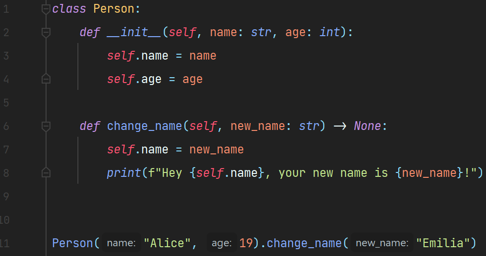

# Python Inlay Hints

This plugin _(quite decently)_ implements inlay parameter hints support for <b>Python</b>.

##  Supported expressions

Pretty much any expression is supported:
* dataclass and class instantiation
* lambdas
* decorators
* function calls
* etc.  

**Look at the examples below to see how it works.**

## Settings

The plugin can be disabled anytime in IDE settings:

#### Settings -> Editor -> Inlay Hints -> Parameter names -> Python

## Demo Screenshots

 
