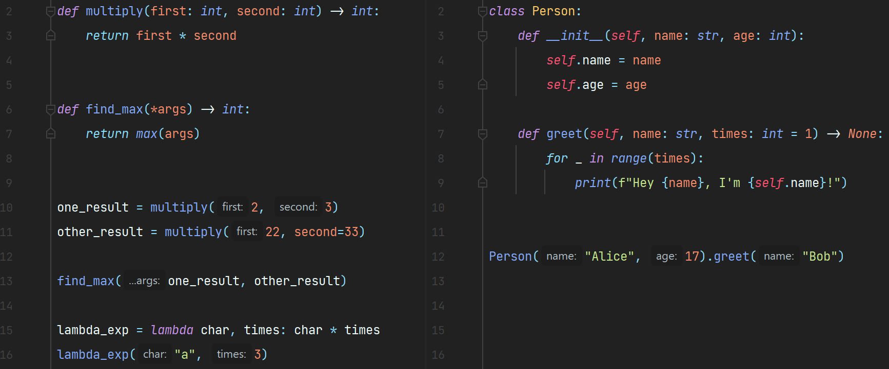

# Python Inlay Params

## Quick Installation

- Using IDE built-in plugin system:

  <kbd>Settings/Preferences</kbd> > <kbd>Plugins</kbd> > <kbd>Marketplace</kbd> >   
  <kbd>Search for "Python Inlay Params"</kbd> > <kbd>Install Plugin</kbd>

- Manually:

  Download the [latest release](https://github.com/WhiteMemory99/intellij-python-inlay-params/releases/latest) and
  install it manually using
  <kbd>Settings/Preferences</kbd> > <kbd>Plugins</kbd> > <kbd>⚙️</kbd> > <kbd>Install plugin from disk...</kbd>

## Description

<!-- Plugin description -->
This plugin _(quite decently)_ implements inlay parameter hints for **Python**.

### Supported expressions

Pretty much any expression is supported:

* dataclass and class instantiation
* lambdas
* decorators
* function calls
* etc.

<!-- Plugin description end -->

**Look at the examples below to see how it works.**

## Settings

The plugin can be disabled anytime in IDE settings:

<kbd>Settings</kbd> -> <kbd>Editor</kbd> -> <kbd>Inlay Hints</kbd> -> <kbd>Parameter names</kbd> -> <kbd>Python</kbd>

## Demo Screenshot

